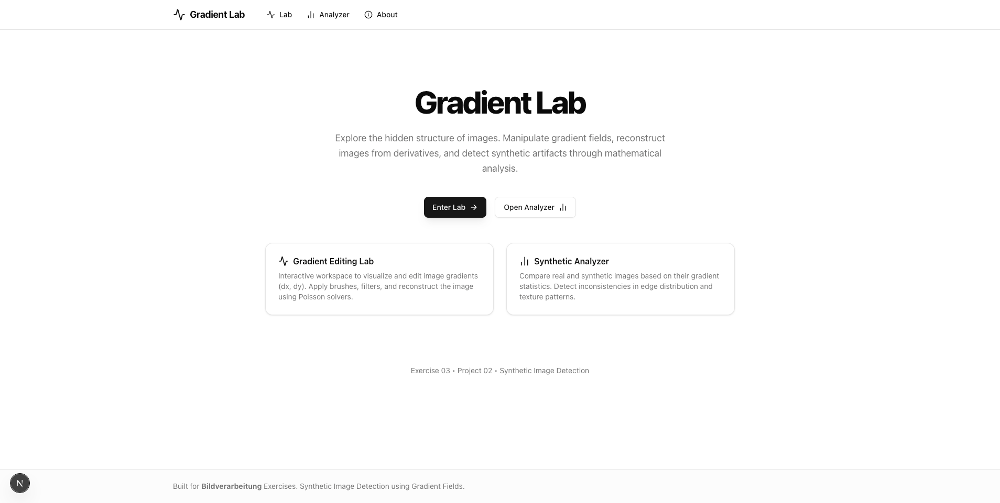
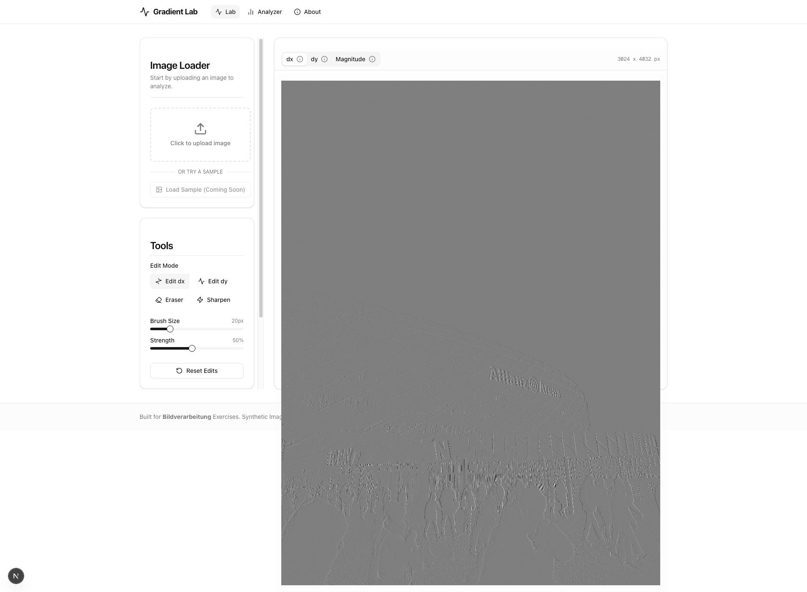
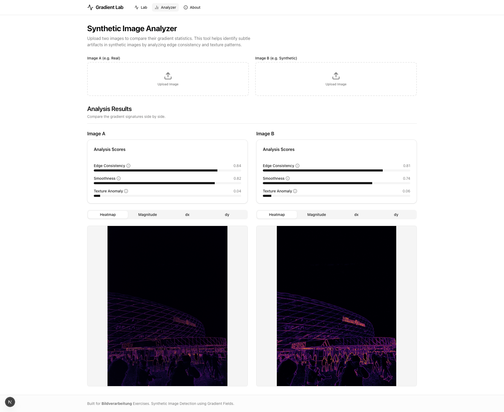

# Synthetic Image Detection using Gradient Fields

Interactive lab for exploring gradient-domain image editing and simple synthetic-image detection. The Python backend handles gradient computation, Poisson-based reconstruction, and lightweight analysis; the Next.js frontend focuses on visualization and user interaction.

## Project layout

- `backend/` — FastAPI service with gradient ops, Poisson solver, and analysis utilities
- `frontend/` — Next.js App Router UI (lab, analyzer, about)
- `Docs/` — architecture, frontend, and backend guides (English)

## Screenshots





## Backend setup

Requirements: Python 3.11+ recommended.

```bash
python -m venv .venv
source .venv/bin/activate  # or .venv\Scripts\activate on Windows
pip install -r backend/requirements.txt
```

Run the API (auto-creates static folders on startup):

```bash
uvicorn backend.main:app --reload --port 8000
```

The app mounts static assets at `/static` and exposes routes for image upload, gradient computation, reconstruction, and analysis.

## Frontend setup

Requirements: Node.js 18+ (Next.js 16) and npm.

```bash
cd frontend
npm install
npm run dev -- --port 3000
```

Configuration:

- API base URL: `NEXT_PUBLIC_API_URL` (defaults to `http://localhost:8000`). Set it in `.env.local` inside `frontend/` if the backend runs elsewhere.

Main routes:

- `/` — intro and entry points
- `/lab` — gradient editing lab (upload, view dx/dy, edit, reconstruct)
- `/analyzer` — synthetic analyzer (compare gradients/heatmaps, show scores)
- `/about` — short backgrounder

## Backend endpoints (quick reference)

- `POST /api/images` — upload an image, returns `imageId` and dimensions
- `GET /api/gradients?imageId=...` — compute dx/dy and visualizations
- `POST /api/reconstruct` — send edited gradients and receive reconstructed image URL
- `POST /api/analyze` — get simple gradient-based scores and optional heatmap

## Documentation

- `Docs/Architecture.md` — high-level system view
- `Docs/Backend.md` — backend design and API details
- `Docs/Frontend.md` — frontend routing, components, and UX guidance
